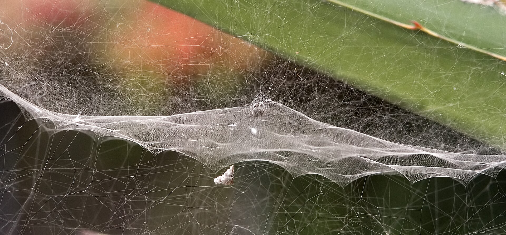
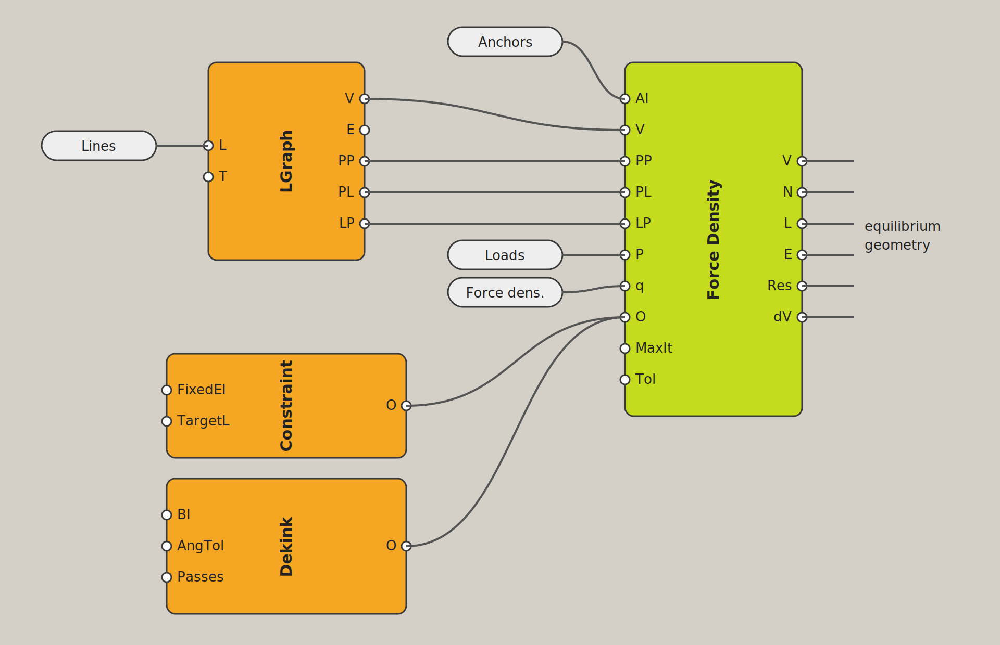

# Opuntia
Force Density Framework for Grasshopper

## Description
Opuntia is a framework for structural form-finding with the Force Density Method (FDM) according to Linkwitz and Schek for the algorithmic modelling software [Grasshopper](https://www.grasshopper3d.com/), which is a plug-in of the commercial 3D computer graphics and computer-aided design application software [Rhinoceros](https://www.rhino3d.com/) (short Rhino3D). The main contribution is an iterative solver based on Jacobi relaxation that computes equilibrium geometries of cable nets and shells directly on a line graph. Constraints such as prescribed edge lengths or the dekinking of boundary nodes are added through a module-based option mechanism, so that further solver methods can be integrated without changing the core solver. The framework was developed in the context of the digital reconstruction of historical cable net structures at the University of Stuttgart. Results were validated against STIFF3D on several examples with deviations below 0.1 %.

The name refers to the opuntia spider (*Cyrtophora citricola*), which is commonly found on prickly pear cacti and builds pretensioned, anticlastic webs. Webs of this kind are documented in the publications of Frei Otto's Institute for Lightweight Structures (IL) in Stuttgart.

*Photo: Olaf Leillinger, Wikimedia Commons, [CC BY 2.5](https://creativecommons.org/licenses/by/2.5/)*

## Documentation

### Components

| Component | Nickname | Category |
|---|---|---|
| Line Graph | LGraph | Opuntia / Graph |
| Constraint Options | Constraint | Opuntia / Options |
| Dekink Options | Dekink | Opuntia / Options |
| Force Density Solver | FDSolver | Opuntia / Solver |

Typical workflow:

---

### 1 · Line Graph `LGraph`

Builds a graph from a list of lines. Points within the tolerance are merged to the first point found; duplicate and degenerate edges are removed. The graph `G` is passed to the solver as a single object.

#### Inputs
| Name | Type | Default | Description |
|---|---|---|---|
| L | List&lt;Line&gt; | – | Input lines |
| T | double | 0.001 | Point merge tolerance (optional) |

#### Outputs
| Name | Type | Description |
|---|---|---|
| G | Opuntia Graph | Graph topology for the solver |

Further outputs can be added by zooming in on the component and clicking **+** (added in this order):

| Name | Type | Description |
|---|---|---|
| V | List&lt;Point3d&gt; | Vertex positions |
| E | List&lt;Line&gt; | Edges |
| PP | DataTree&lt;int&gt; | Point-to-point adjacency (path = vertex index, values = neighbour vertex indices) |
| PL | DataTree&lt;int&gt; | Point-to-line adjacency (path = vertex index, values = incident edge indices) |
| LP | DataTree&lt;int&gt; | Line-to-point adjacency (path = edge index, values = [start, end] vertex indices) |

---

### 2 · Constraint Options `Constraint` (Method 1)

Target-length constraint for selected edges (e.g. compression struts). Connect the output to the solver's `O` input.

#### Inputs
| Name | Type | Description |
|---|---|---|
| FixedEI | List&lt;int&gt; | Edge indices subject to target-length constraint |
| TargetL | List&lt;double&gt; | Target lengths, paired with FixedEI |

#### Output
| Name | Type | Description |
|---|---|---|
| O | ConstraintOptions | Option object for the solver |

The force density of a constrained edge is not held constant: in each correction step it is derived from local nodal equilibrium, so that the edge carries exactly the residual force along its axis.

---

### 3 · Dekink Options `Dekink` (Method 3)

Boundary dekinking. Removes kinks at selected boundary nodes by extrapolation along collinear neighbours, followed by re-relaxation. Connect the output to the solver's `O` input.

#### Inputs
| Name | Type | Default | Description |
|---|---|---|---|
| BI | List&lt;int&gt; | – | Indices of boundary nodes to dekink |
| AngTol | double | 30.0 | Minimum collinearity angle (degrees) for extrapolation |
| Passes | int | 3 | Number of dekink + re-relaxation passes after convergence |

#### Output
| Name | Type | Description |
|---|---|---|
| O | DekinkOptions | Option object for the solver |

---

### 4 · Force Density Solver `FDSolver`

Iterative Force Density solver (Jacobi relaxation) for equilibrium form-finding of cable nets and shells.

#### Inputs
| Name | Type | Default | Description |
|---|---|---|---|
| Fix | List&lt;string&gt; | – | Supports (optional), see below |
| G | Opuntia Graph | – | Graph from LGraph |
| P | List&lt;Vector3d&gt; | – | External load vector per node (optional) |
| q | List&lt;double&gt; | – | Force density per edge |
| O | List&lt;Option&gt; | – | Constraint and/or Dekink options (optional) |
| MaxIt | int | 1000 | Maximum number of iterations |
| Tol | double | model tolerance | Convergence tolerance |

#### Outputs
| Name | Type | Description |
|---|---|---|
| V | List&lt;Point3d&gt; | Optimised node positions |
| N | List&lt;double&gt; | Axial force per member, N = q · L |
| L | List&lt;double&gt; | Member lengths |
| E | List&lt;Line&gt; | Result edges as lines |
| Res | List&lt;double&gt; | Force-equilibrium residual per node (fixed axes excluded) |
| dV | List&lt;double&gt; | Displacement of each node in the final iteration |

#### Supports
Each entry of `Fix` is a vertex index, optionally followed by the axes to be fixed:

| Entry | Meaning |
|---|---|
| `3` | Vertex 3 fixed in x, y and z |
| `3xy` | Vertex 3 fixed in x and y, free in z |
| `7z` | Vertex 7 fixed in z, free in x and y |

A plain list of integers can be connected directly. Vertex indices can be checked with *Point List* or found with *Closest Point*.

#### Sign convention
| Value | Meaning |
|---|---|
| q > 0 | Tension (cable) |
| q < 0 | Compression (strut/mast) |

#### Method
Each node $i$ is in equilibrium when the edge forces to its neighbours and the external load cancel out:

$$\sum_{j \in N(i)} q_{ij}\,(x_j - x_i) + p_i = 0$$

Solving for $x_i$ gives the Jacobi update used in each iteration $k$:

$$x_i^{(k+1)} = \frac{\sum_{j \in N(i)} q_{ij}\,x_j^{(k)} + p_i}{\sum_{j \in N(i)} q_{ij}}$$

where $x_i$ is the position of node $i$, $N(i)$ the set of its neighbour nodes, $q_{ij}$ the force density of the edge between $i$ and $j$, and $p_i$ the external load at node $i$. In words: each free node moves to the force-density-weighted average of its neighbours, shifted by its load. Fixed axes keep their initial coordinates. Constraint options act during iteration; Dekink options act after convergence.

#### Convergence
The solver stops when the largest node displacement between two iterations falls below the tolerance, or when MaxIt is reached:

$$\max_i \left| x_i^{(k)} - x_i^{(k-1)} \right| < \text{Tol}$$

---

## Examples
Example definitions are provided in the `examples/` folder.

## Requirements
- Rhino 7 or 8
- .NET Framework 4.8

## Installation
1. Build in Visual Studio (Release).
2. Copy `.gha` to `%APPDATA%\Grasshopper\Libraries\`.
3. Right-click → Properties → Unblock.
4. Restart Rhino.

## License
MIT License © 2026 Baris Wenzel. See `LICENSE` for details.
